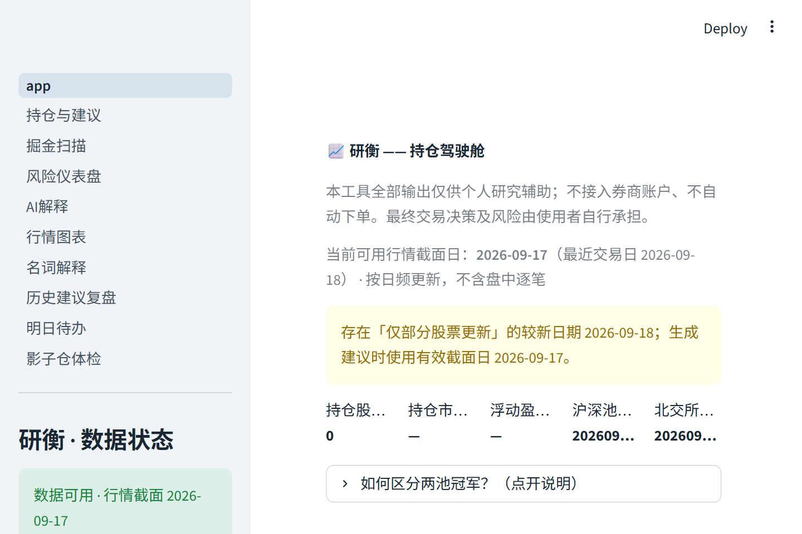
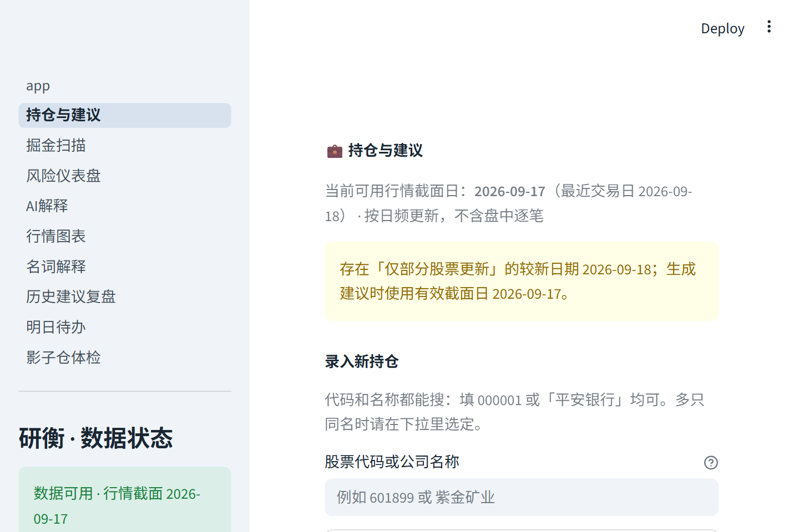
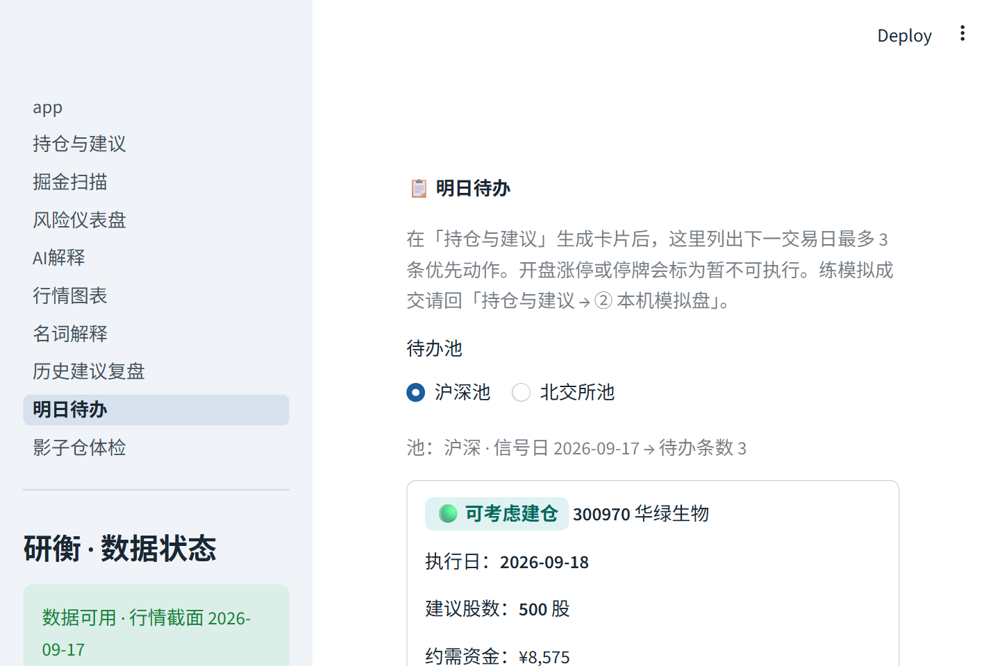
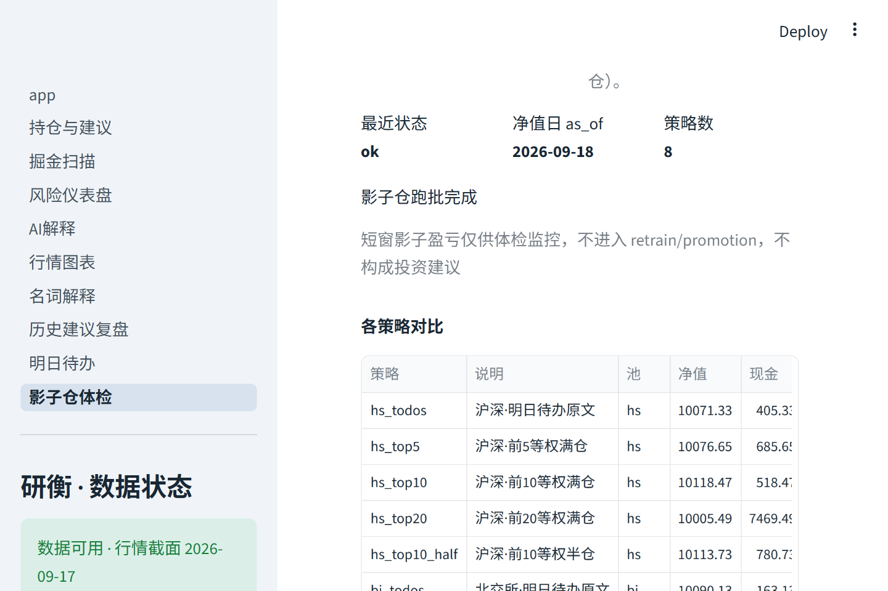
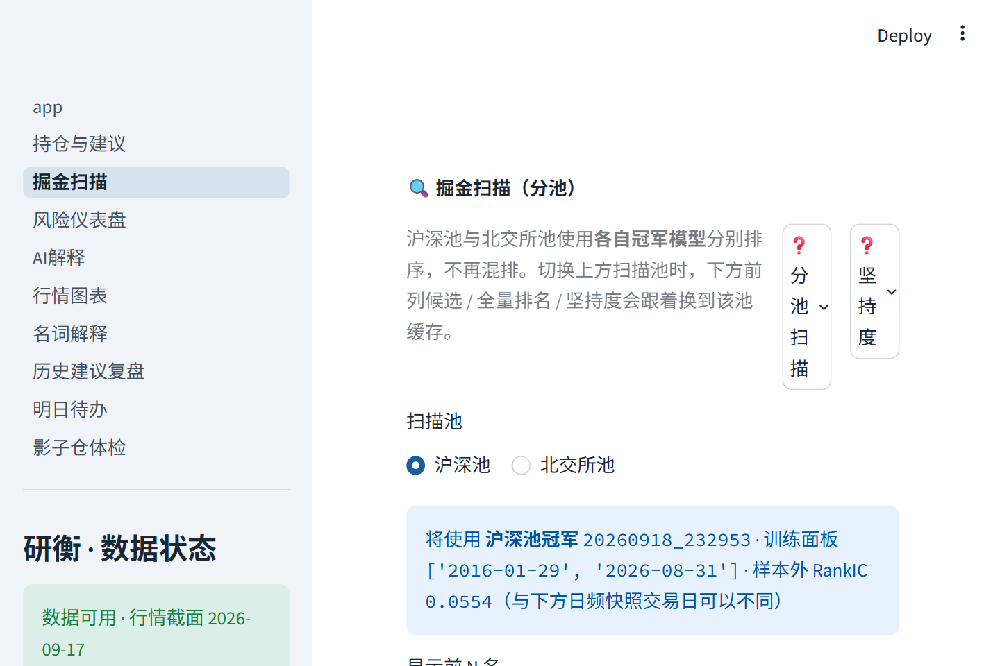

# 研衡 用户使用说明书

> **文档类型**：产品文档（用户侧）  
> **产品**：研衡 — 本机 A 股日频投研辅助  
> **版本**：2.6
> **日期**：2026-09-19  
> **读者**：自己看盘、自己下单的个人使用者  
> **阅读格式**：请打开同目录「用户使用说明书.html」（可翻页、目录、全文检索、主题索引）。本文是 HTML 的源稿。

---

## 文档导航

| 栏目 | 你要解决的问题 |
|------|----------------|
| [产品概述](#产品概述) | 这是什么、能做什么、产品边界 |
| [快速入门](#快速入门) | 第一次打开、五分钟走通主路径 |
| [操作指南](#操作指南) | 每个页面怎么点、卡片上每个数字什么意思 |
| [实践教程](#实践教程) | 收盘后、次日、周末分别干什么 |
| [安全合规](#安全合规) | 表述边界、数据存放、不下单 |
| [服务支持](#服务支持) | 常见问题、相关文档、修订记录 |

灌库、重训、计划任务等运维步骤，请到文末「相关文档」查阅。日常使用以本说明书正文为主。

---

## 产品概述

### 什么是研衡

研衡是安装在本机的投研辅助控制台。它读取本机行情与财务数据、已晋升的冠军排序模型，以及您录入的持仓，生成可执行的日频待办：买哪只、买多少股、参考什么价、何种条件下作废。同时提供本机模拟盘，便于在不动真金白银前先把规则跑顺。

一句话定位：**场景化投研决策辅助。** 研衡不替代券商、不自动下单、不提供荐股承诺。

产品名含义：**研**指可复现的研究过程；**衡**指先衡量可能亏损，再讨论可能收益。



### 您能感知到的处理流程

```text
本机数据仓库（收盘后更新）
        ↓
冠军排序模型（只读已晋升版本）
        ↓
建议引擎（先判断能否成交 → 再看止损与集中度 → 再看模型 → 最后才谈再平衡）
        ↓
控制台：待办 / 建议卡片 / 模拟盘 / 复盘
        ↓
您：在券商软件中手动下单，或仅在本机点击「模拟成交」
```

系统不连接券商柜台，也不读取同花顺、东方财富等客户端中的真实委托。

### 应用场景

| 场景 | 研衡提供的帮助 | 仍需您自行完成 |
|------|----------------|----------------|
| 收盘后不知次日盯哪几只 | 明日待办最多 3 条，含股数与执行日 | 决定是否执行 |
| 想买但不知买多少 | 按净值、止损距离、100 股手数给出股数与参考最大亏损 | 在券商下单 |
| 担心冲动加仓、单票过重 | 观望为正式动作；单票默认不超过净值 15%；浮亏不加仓 | 遵守纪律 |
| 年底约 1 万闲钱实操前 | 先用 1 万模拟账户把规则跑顺 | 真金白银仍在券商软件 |
| 核对「上次建议后来怎样」 | 复盘页：建议快照与后来价格；模拟过则有成交价差 | 不把涨跌当作「照做必赚」 |

### 相对普通行情软件的差异

- **按账户状态区分建议**：同一只股票，空仓、已持有、已超限时，建议不同。
- **给出可下单的股数**：买不起 1 手（100 股）时改为观望，并写明原因。
- **失效条件可现场核对**：例如次日开盘涨停不可买、收盘跌破参考止损价。
- **模拟与实盘记录分开**：练习账户不影响您手录的真实持仓。
- **每条建议可回放**：当时理由、冠军模型编号、数据截止日均留在账本中。

### 功能清单

| 模块 | 控制台入口 | 状态 |
|------|------------|------|
| 持仓驾驶舱 | 首页 | 已提供 |
| 持仓录入与建议卡片 | 持仓与建议 | 已提供 |
| 明日待办（最多 3 条） | 明日待办 | 已提供 |
| 本机模拟盘（含 T+1、费用、幂等） | 持仓与建议 → 模拟盘 | 已提供 |
| 机器影子仓农场（每周 8 户 · 留存 60 天 · 1/3/7/15/20/30 日汇总） | 影子仓体检；日更 03:00 盯市 + 周六新建本周队列换票 | 已提供 |
| 全市场排序 | 掘金扫描 | 已提供 |
| 集中度、风险价值、回撤 | 风险仪表盘 | 已提供 |
| K 线与成本、止盈止损线 | 行情图表 | 已提供 |
| 结构化信号的中文说明 | AI 解释 | 已提供（需可选密钥） |
| 建议与后来价格、成交对照 | 历史建议复盘 | 已提供 |
| 术语说明 | 名词解释、各页问号 | 已提供 |

以下能力不在产品范围内（产品边界，后续也不会做成「自动下单」）：

- 代客下单、自动报单、对接同花顺条件单
- 秒级行情、抢涨停、高频交易
- 收益承诺、跟单致富话术
- 用大模型直接给出买卖指令

### 使用限制

请在下列限制内使用。超出限制时，界面会提示或拒绝操作。

| 限制项 | 默认值 | 说明 |
|--------|--------|------|
| 决策频率 | 日频 | 信号日收盘 → 下一交易日执行；不含盘中逐笔 |
| 建议默认资金模板 | 1 万元练习口径 | 买不起 1 手（100 股）不得开仓，改为观望 |
| 同时持仓 | 最多 2–3 只 | 小资金约束 |
| 单票上限 | 净值的 15% | 超限建议减仓，优先于「还在赚钱」 |
| 现金缓冲 | 不少于净值 10% | 以损定仓时预留 |
| 止盈 / 止损参考 | ±8% | 与冠军模型训练标签一致 |
| 明日待办 | 最多 3 条 | 同一申万行业开仓待办最多 1 只 |
| 模拟成交价 | 次日开盘价加减约 0.1% 滑点 | 配置滑点，不含逐档盘口 |
| 数据新鲜度 | 全市场截面日对齐最近交易日 | 缺涨跌停价、缺市值基本面时，扫描与建议整页阻塞 |

A 股硬约束（模拟盘会执行，实盘由券商执行）：当日买入次日方可卖出（T+1）、买卖须为 100 股整数倍、涨停买不进、跌停卖不出、停牌、佣金与印花税。

### 费用说明

研衡为本机自用软件，无云产品式按量计费页。

您可能自行承担的费用（与研衡无关）：

- 本机电脑与电费
- 数据接口：若使用第三方行情接口，按其官网套餐
- AI 解释：若配置通义千问，按阿里云百炼额度

研衡不收取交易佣金，也不经手证券资金。

---

## 快速入门

目标：从打开控制台到看懂一张建议卡片。预计 5 至 15 分钟（不含首次灌库）。

### 准备工作

| 项 | 要求 |
|----|------|
| 系统 | Windows，已安装本项目及虚拟环境目录「.venv」 |
| 数据 | 本机已有「data/warehouse.duckdb」，且通过就绪检查（见下文） |
| 浏览器 | 建议使用 Chrome 或 Edge；地址一般为 http://localhost:8501 |
| 持仓信息 | 准备至少一只真实持仓的 6 位代码、股数、每股成本（填写「600000」这类代码即可） |

### 启动控制台

**方式甲（推荐）**：双击项目目录下的「研衡启动器.exe」（若已打包）。会弹出黑色日志窗口，请保持打开，浏览器随后打开。

**方式乙**：在 PowerShell 中执行：

```powershell
cd 你的路径\stock-quant-system
.\.venv\Scripts\python.exe -m streamlit run app.py --server.port 8501
```

浏览器打开：http://localhost:8501

> **注意**：修改过程序或页面后，须关闭命令行窗口再重新启动；仅刷新浏览器不够。请勿同时开两个启动器占用同一端口。

### 检查数据是否可用

左侧栏「研衡 · 数据状态」应显示「数据可用」。若出现红色「数据未就绪」，请先处理数据，再生成建议。

也可在项目目录执行：

```powershell
.\.venv\Scripts\python.exe -m scripts.check_warehouse_readiness
```

退出码为 0 时，方可生成建议、扫描、明日待办。非 0 时相关按钮禁用，用于避免用残缺数据做决策。

阻塞常见原因：

- 涨跌停价表当天覆盖不足
- 市值基本面覆盖不足
- 行情截面落后最近交易日超过门槛
- 后台正在灌库（页面会变为只读）

数据更新由运维或计划任务负责，步骤见文末「相关文档」中的投产日课。日常交易日内，一般无需在盘中做大批量数据更新。

### 五分钟主路径

1. 浏览器打开 http://localhost:8501。左侧栏最上方应是 **app**（首页「持仓驾驶舱」）。
2. 看左侧 **「研衡 · 数据状态」**：应是绿色「数据可用」。若是红色「数据未就绪」，先不要生成建议。
3. 点左侧 **「持仓与建议」** → 在「股票代码或公司名称」输入框搜代码或名称 → 若出现下拉，**点选**目标股 → 填「股数」「建仓成本价」→ 点 **「添加持仓批次」** → 应出现绿色「已添加持仓：…」。
4. 同一页往下到 **「① 建议卡片」** → 「建议池」选 **沪深池** → 点 **「🔄 生成/刷新建议卡片」** → 等待转圈结束（几十秒正常）。
5. 应看到「持仓相关建议」和/或「观察名单」表格；观察名单用下拉 **「点选查看完整建议卡片」** 打开单张卡片。
6. 点左侧 **「明日待办」** → 「待办池」选沪深池 → 应看到最多 3 条（或提示当前无需优先动作）。
7. （可选）回「持仓与建议」→ 滚到 **「② 本机模拟盘」** → 「账户模板」选「一万练习账户（推荐）」→ 点 **「① 创建新模拟账户」** → 再点 **「② 一键练习」**。
8. 点左侧 **「历史建议复盘」** → 顶部「建议条数」应 > 0。

到这里，快速入门完成。下面按页面逐步展开（按钮名以界面原文为准）。

---

## 操作指南

### 控制台与导航（先认路）

1. 打开 http://localhost:8501 后，**左侧边栏**从上到下一般是：
   - **app**（首页，标题为「研衡 —— 持仓驾驶舱」）
   - 持仓与建议  
   - 掘金扫描  
   - 风险仪表盘  
   - AI解释  
   - 行情图表  
   - 名词解释  
   - 历史建议复盘  
   - 明日待办  
   - 影子仓体检  
2. **怎么换页**：用鼠标点左侧对应名称即可；当前页会高亮。
3. **数据状态**：侧栏下方固定有 **「研衡 · 数据状态」**。  
   - 绿：可生成建议 / 扫描 / 待办。  
   - 红或黄：先读页顶黄条/红条说明。  
   - 可点 **「刷新数据状态」** 再检查一次。  
4. **页脚**（每页底部）：数据截止日、沪深/北交所冠军摘要、滑点说明、免责声明。以页脚日期与冠军编号为准。

| 入口（侧栏原文） | 你要做的事 |
|------------------|------------|
| app（持仓驾驶舱） | 总览指标、今日决策速览、按名称查代码 |
| 持仓与建议 | 录持仓、生成卡片、练模拟盘 |
| 掘金扫描 | 分池全市场排名 |
| 风险仪表盘 | 看手录持仓集中度与 VaR |
| AI解释 | 看结构化数字 + 可选中文翻译 + 新闻 |
| 行情图表 | K 线与成本/止盈止损线 |
| 名词解释 | 搜术语大白话 |
| 历史建议复盘 | 看历史建议方向；回写券商成交 |
| 明日待办 | 次日最多 3 条优先动作 |
| 影子仓体检 | 周队列 8 策略净值（留存 60 天）；导出；周末自动开户换票 |

### 如何区分「冠军」

研衡有两份正式模型，不要混看：

| 名称 | 指针文件 | 打分对象 | 哪里能看到 |
|------|----------|----------|------------|
| 沪深池冠军 | `mlops/registry/champion_hs.json` | 上交所 + 深交所 | 首页「沪深池冠军」指标、页脚、掘金选「沪深池」 |
| 北交所池冠军 | `mlops/registry/champion_bj.json` | 北交所 | 首页「北交所池冠军」指标、页脚、掘金选「北交所池」 |

**在首页核对：**

1. 打开 **app** 首页。  
2. 看一行五个指标里的 **「沪深池冠军」「北交所池冠军」**（显示 run 编号）。  
3. 点开折叠 **「如何区分两池冠军？（点开说明）」**，对照表里的训练区间与 RankIC。  
4. 记住：训练面板常是**月末截面**；掘金/建议用的是**最近有效交易日**——两者日期不同是正常的。

### 首页：持仓驾驶舱

**路径**：侧栏点 **app**（或首次打开默认页）。

1. **应看到**：标题「📈 研衡 —— 持仓驾驶舱」、免责声明、行情截面日说明；可能有黄条「仅部分股票更新」。  
2. **五个指标**：持仓股票数 / 持仓市值合计 / 浮动盈亏合计 / 沪深池冠军 / 北交所池冠军。无持仓时市值与盈亏可为「—」。  
3. **「🎯 今日决策速览」**（有建议记录时出现）：按优先级排列的卡片摘要。若没有，先去「持仓与建议」生成建议。  
4. **「持仓明细」**：有持仓时显示聚合表；标题旁 **❓** 可点开「集中度」解释。  
5. **「🔍 按名称查代码」**：  
   - 在搜索框输入「紫金矿业」→ 应能对应到 `601899`；  
   - 输入「中信」等重名 → 须在下拉里点选。  
6. 需要改持仓或生成建议 → 转 **「持仓与建议」**。


### 持仓与建议：录入与平仓

**路径**：侧栏 **「持仓与建议」**。



**A. 录入一批持仓**

1. 找到标题 **「录入新持仓」**。  
2. 在 **「股票代码或公司名称」** 输入 `000001` 或「平安银行」等。  
3. 若出现下拉候选，**必须点选一行**，不要只打字不选。  
4. 在表单里填：  
   - **股数**（须 > 0，建议按 100 的倍数，与实盘一致更好）  
   - **建仓成本价（每股）**（须 > 0）  
   - **建仓日期**（默认同日）  
   - **备注（可选）**  
5. 点蓝色 **「添加持仓批次」**。  
6. **应看到**：绿条「已添加持仓：代码 股数股 @ 成本」；下方 **「当前持仓（未平仓批次）」** 出现该批次。  
7. **若失败**：红字「请先用上方搜索框选定股票，且股数、成本价需大于0」——检查是否未点选下拉、或数字为 0。  
8. 后台灌库时按钮可能灰掉，提示只读——等更新结束再录。

**B. 平仓（仅改本机记录）**

1. 在「当前持仓」每条右侧点 **「平仓」**。  
2. 该批次从「未平仓」列表消失（写入已平仓标记）。  
3. **不会**通知券商；券商侧需您自行卖出。

**说明**：系统没有券商现金字段。集中度按「已录入持仓市值之和」近似净值。漏录会导致风险页与建议失真。

### 持仓与建议：生成建议卡片

**路径**：同一页往下 **「① 建议卡片（先看建议，再练模拟）」**。

1. **「建议池」** 单选：点 **「沪深池」** 或 **「北交所池」**（横向两个选项）。  
2. 点 **「🔄 生成/刷新建议卡片」**（数据未就绪或灌库中时为灰色，属保护）。  
3. **等待**：出现「正在扫描…」转圈，几十秒属正常。  
4. **成功后应看到**：  
   - 说明「池：… · 建议对应交易日：YYYY-MM-DD」；  
   - **「持仓相关建议」**：若有持仓，多张带动作色块的卡片；  
   - **「👀 观察名单」**：表格 + 下拉 **「点选查看完整建议卡片」** → 选一行后下方展开完整卡片；  
   - 可选 **「📋 本池明日待办摘要」**（最多 3 条）；完整列表请转侧栏 **「明日待办」**。  
5. 若从未生成过且未点按钮：蓝字提示先点生成，或直接去下方「一键练习」。  
6. 刷新页面后，系统会尝试从库内快照加载最近建议（标题旁可能写「来自库内快照」）。

**卡片上重点看**：动作、建议股数、约需资金、参考止损/止盈价（人民币）、执行日、失效条件、大白话。点卡片上的展开/开关可看更多理由（界面为 toggle 详情）。

### 建议卡片字段（读懂再行动）

| 您看到的 | 含义 | 常见误解 |
|----------|------|----------|
| 动作 | 观望 / 可考虑建仓 / 持有 / 减仓 / 止损 / 止盈 / 再平衡 | 误以为系统已代为下单 |
| 置信度 | 按模型排名分位换算 | 误以为是胜率或盈利概率 |
| 建议股数 | 100 股的整数倍 | 误以为可买 1 股碎股 |
| 约需资金 | 含简化费用估算 | 误以为等于券商实际扣款 |
| 占净值约 | 相对建议所用账户净值 | 误以为等于券商总资产 |
| 参考最大亏损 | 若触及止损价，这一笔大约亏多少 | 误以为保证最多亏这么多 |
| 参考止损 / 止盈价 | 成本或现价 × (1±8%) | 误以为是个性化止损 |
| 执行日 | 默认下一交易日 | 误以为今日盘中立刻成交 |
| 失效条件 | 盘中或次日可核对的句子 | 误以为可随意忽略 |
| 理由包一句话 | 因子说明；若有行为冲突会写明 | 误以为冲突会被忽略 |

**动作对照**

| 动作 | 大致含义 | 建议用法 |
|------|----------|----------|
| 观望 | 停牌或涨跌停，或买不起 1 手，或信号不够强 | 视为正式结论 |
| 建仓 | 未持有且排名进入前 50，且以损定仓后买得起 1 手 | 视为候选，自行决定仓位 |
| 持有 | 未触发止损或超限 | 不代表一定会上涨 |
| 减仓 | 常见原因：单票超过 15% | 风控优先于账面利润 |
| 止损 | 浮亏触及约 −8% | 阈值来自模型训练标签 |
| 止盈 | 浮盈约 +8%，且模型排名已走弱 | 仅赚钱而排名仍靠前时，不会仅因赚钱就建议卖出 |
| 再平衡 | 组合权重偏离过大 | 只叠在「本来是持有」的票上，不会覆盖止损 |

系统不会因浮亏而建议加仓。此为产品规则。

### 明日待办

**路径**：侧栏 **「明日待办」**（须先在「持仓与建议」生成过对应池建议）。



1. 打开本页；若数据未就绪，整页停在阻塞说明，无法操作。  
2. **「待办池」** 选 **沪深池** 或 **北交所池**（须与您刚才生成建议的池一致）。  
3. **应看到**：  
   - 「信号日 … → 待办条数 n」；  
   - 每条卡片含：动作色块、代码、**执行日**、建议股数、约需资金、大白话；  
   - 若开盘涨停/停牌等，黄条 **「暂不可按规则执行」**。  
4. 若提示「尚无建议记录」→ 回 **「持仓与建议」**，切到同一池，点 **「生成/刷新建议卡片」**，再回来。  
5. 若提示「当前没有需要次日优先执行的动作」→ 属正常（例如没有通过以损定仓的开仓）。  
6. **练模拟**：本页不下单；请回 **「持仓与建议 → ② 本机模拟盘」**。

规则：最多 3 条；开仓类同一行业代码最多 1 只（止损/减仓不受此限）。

### 本机模拟盘

**路径**：**「持仓与建议」** 页滚到 **「② 本机模拟盘（假账本，与上方手录持仓无关）」**。

| 账户模板（点开「账户模板」下拉；界面可能显示中文名或内部名） | 初始现金 | 适合 |
|----------------------|----------|------|
| **一万练习账户（推荐）**（内部名 `live_prep_10k`） | 1 万元 | 接近年底实操资金 |
| **十万练习账户**（内部名 `practice_100k`） | 10 万元 | 规则练手（仍受 15% 与手数约束） |

**推荐操作顺序**

1. （可选）勾选 **「允许明日待办纳入北交所开仓（默认关）」**——一般保持不勾。  
2. 找到标签 **「账户模板」**，点开下拉：  
   - 优先选中文项 **「一万练习账户（推荐）」**；  
   - 若下拉暂时只显示内部名，选带 **`live_prep_10k`** 的那一项（一万）或 **`practice_100k`**（十万）。  
3. 点 **「① 创建新模拟账户」** → 页面刷新后，本区应出现「当前模拟账户：…」及现金/净值信息。  
   - 若从未创建，直接点「一键练习」也会自动建账户。  
4. 确认上方 **「建议池」** 已选好 → 点 **「② 一键练习」**。  
   - 作用：生成当前池建议 + **只模拟明日待办最多 3 条**。  
5. **应看到**：成交 / 待开盘 / 拒绝 的统计与净值变化。  
   - **待开盘**：缺次日开盘价时正常，等行情更新后可用 **「③ 仅再模拟待办」** 重试（不重新全市场扫描）。  
6. 展开区内可看近 7 日摘要（成交笔数、净值变化等）。

规则摘要：次日开盘价 ± 配置滑点；T+1（当日买不可当日卖会拒绝）；同一建议幂等；佣金/印花税按 A 股规则模块。模拟净值勿当作实盘战绩。

### 影子仓体检

**路径**：侧栏 **「影子仓体检」**。与人手模拟盘分离；**不必**先点「生成建议」（周末任务会自动补）。



1. 打开本页，读顶部说明（每周新建 8 户、留存 ≥60 天；每日 03:00 盯市；周六灌库→双池建议→本周队列换票）。
2. （可选）展开 **「8 套策略是什么？」** 查看策略规矩表（规矩固定，账户按周滚动）。
3. 若库内已有报告：应看到 **最近状态 / 净值日 as_of / 本周队列 / 留存账户**，以及「影子仓跑批完成」或「日更盯市」类说明。
4. 需要立刻重算并允许本周换票：点 **「立即跑一批影子仓」** → 等待「正在确保本周队列并盯市…」→ 成功后页面刷新。
5. 「本周队列各策略对比」看当前周 8 户；下方「历史净值快照」含往周仍在留存期内的账户。
6. 需要带走：点 **「导出 CSV / JSON / Markdown」** 之一下载。
7. （可选）点 **「用 AI 解读本次汇总」**；未配密钥时展开 Markdown 摘要复制到其他大模型。

**预期**：约每过一周多 8 个账户；同时活跃粗算上限 **64**（8×floor(60/7)）；30 天内约 ~40。监测文件在 `data/shadow_farm/accounts/` 与 `panel_latest.csv`。短窗盈亏**只作监控**，不会自动改冠军模型。

### 掘金扫描

**路径**：侧栏 **「掘金扫描」**。



1. 打开本页；数据未就绪时会阻塞，无法扫描。  
2. **「扫描池」** 选 **沪深池** 或 **北交所池**。  
3. 应出现蓝条/黄条：将使用哪一池冠军、`run_id`、训练面板区间、样本外 RankIC。北交所冠军缺失时不能扫该池。  
4. 拖动滑块 **「显示前 N 名」**（10～200，默认 50）。  
5. 点 **「🔄 运行最新扫描」** → 等待「正在加载…并打分」。  
6. **成功后**出现三个页签：  
   - **「前列候选（含行为冲突提示）」**  
   - **「全量排名」**  
   - **「榜单 / 坚持度」**（历史名次稳定性，**不是胜率**）  
7. 表中「行为冲突提示」只提示，不改排名。  
8. 标题旁 **❓**（分池扫描 / 坚持度）可点开术语说明。

### 风险仪表盘

**路径**：侧栏 **「风险仪表盘」**（看的是**手录持仓**，不是模拟盘/影子仓）。

1. 无持仓时：提示无数据或类似状态。  
2. 有持仓时顶部指标：持仓股票数、最大单票占比、组合 1 日风险价值(95%)；旁有 **❓ 风险价值**。  
3. 单票 >15% 时顶部 **红警告**「建议减仓分散」。  
4. **「持仓集中度」**：水平柱图（不是饼图），红虚线 **「15%上限」**，超限柱为红色；下方有对照表。标题旁 **❓ 集中度**。  
5. 继续往下：**「逐股票波动率 / 风险价值」**、**「持仓相关性矩阵」**、回撤相关图（按当前权重重放历史的假设轨迹）。  
6. 要改持仓权重 → 回 **「持仓与建议」** 改录入。

### 行情图表

**路径**：侧栏 **「行情图表」**。

1. 用与持仓页相同的搜索框输入代码或名称并选定。  
2. **应看到**：前复权 K 线。  
3. 若该股在「持仓与建议」里仍有未平仓批次：图上有成本、参考止损、参考止盈三条虚线（与卡片同一套 ±8%）。  
4. 输入不存在代码（如 `999999`）：友好提示无行情，**不应**整页红屏崩溃。

### AI 解释

**路径**：侧栏 **「AI解释」**。

1. 用搜索框选定一只股票（如 `000001`）。  
2. **左侧「结构化数据」**：模型分、排名、因子、行为标签、带发布时间的新闻标题等（自动计算/抓取）。  
3. **右侧「中文说明」**：  
   - 已配置通义密钥：自动生成说明；  
   - 未配置：黄条提示，左侧数字仍可用。  
4. 下方 **「最新相关新闻」**：点标题可打开东方财富链接（即时检索，非灌库）。  
5. 可展开 **「名次明细」** 看掘金名次走势（须以前跑过掘金扫描）。  
6. 若说明里出现「立刻满仓」「建议买入」等措辞，**以左侧数字与建议卡片为准**。  
7. 密钥放在项目根目录 `.env`，勿提交到 git。

### 历史建议复盘

**路径**：侧栏 **「历史建议复盘」**。

1. 顶部两个指标：**「建议条数」**、**「已关联成交的建议」**。  
   - 建议条数 = 曾生成并落库的快照；  
   - 已关联成交 = 同一条既有快照又有成功成交（模拟或确认实盘）；为 0 表示还没走过模拟/确认。  
2. 累计交易日很少时会出现黄条，提醒「先用几周再当真」。  
3. 下方表格/筛选：可按条件缩小范围；清空筛选后若无匹配，提示「没有符合当前筛选条件的记录」。  
4. 「方向正确 / 不利」用的是建议日收盘→最新收盘，**未计入**您是否真买到、买了多少。  
5. 若有完整成交，可看到「建议价与成交价偏差」表。

### 确认成交（实操回写）

**路径**：**「历史建议复盘」** 页滚到 **「券商已成交？回写到本机账本」**。

1. 须先在「持仓与建议 → 本机模拟盘」创建过练习账户，否则提示去创建。  
2. 在表单填写：建议编号、代码、方向（买入/卖出）、股数、实际成交价、成交日。  
3. 点 **「确认写入」**。  
4. 成功：绿条显示 trade_id；失败/跳过：黄或红字原因。  
5. **不会**登录券商；只是把价格记入本机账本便于对比。

### 名词解释与问号

**路径**：侧栏 **「名词解释」**；或任意页指标旁的 **❓**。

1. 打开「名词解释」：默认列出全部术语卡片。  
2. 在 **「搜索术语（留空显示全部）」** 输入 `VaR` 或 `回撤` 等 → 只显示命中项。  
3. 搜不到（如 `xyz123`）：空列表，页面不崩。  
4. 各页 ❓ 与本页是**同一套**文案，点开即可，无需跳页。

---

## 实践教程

### 教程一：交易日收盘后（主路径）

**适用**：侧栏显示「数据可用」，且未出现「数据未就绪」红条。

1. 打开 **app** 首页，看页脚/黄条确认截面日；看「沪深池冠军」编号。  
2. 点 **「持仓与建议」**：核对手录持仓是否与券商一致；有成交先「平仓」旧批次再「添加持仓批次」。  
3. 「建议池」选沪深池 → 点 **「🔄 生成/刷新建议卡片」** → 等结束。  
4. 先读「持仓相关建议」里的止损/减仓，再读观察名单建仓候选。  
5. 点 **「明日待办」**，把 1～3 条的执行日、股数、失效条件抄到自己的备忘。  
6. 条件已失效（涨停/停牌黄条）→ 不要硬买。

### 教程二：次日只练习、不下真钱

1. 「明日待办」若标「暂不可按规则执行」→ 视为作废或继续观望。  
2. 回「持仓与建议」→「② 本机模拟盘」→ 有账户后点 **「② 一键练习」**（或行情补齐后点 **「③ 仅再模拟待办」**）。  
3. 看成交 / 待开盘 / 拒绝；T+1、手数、涨停拒绝均为正常。  
4. 请勿把模拟净值发到社交网络当作战绩。

### 教程三：次日在券商手动下单

1. 仍以「明日待办」为清单，在券商软件自行委托。  
2. 涨停买不进、T+1 卖不出：以券商为准。  
3. 成交后：回「持仓与建议」改手录持仓；可选「历史建议复盘」底部 **「确认写入」** 回写成交价。  
4. 收盘后再生成一次持仓类建议（卖出、减仓、止盈止损）。

### 教程四：周末复盘

1. **「历史建议复盘」**：看建议条数与方向统计；样本少时听黄条提醒。  
2. **「持仓与建议」** 模拟盘区：看近 7 日成交与净值。  
3. **「风险仪表盘」**：单票是否仍超 15%。  
4. **「影子仓体检」**：确认状态为 ok、本周队列有 cohort_id、留存账户数合理；需要时导出 Markdown。短窗盈亏只作监控。
5. 冠军是否更换以首页/页脚两池编号为准；个人使用者一般不必自行重训。

---

## 安全合规

### 法律与表述

- 全部输出为个人研究辅助，不构成投资建议、保本承诺或适当性评估。
- 最终交易决策与盈亏由使用者自行承担。
- 请勿把研衡的卡片转发给他人当作荐股。本工具没有持牌投顾流程。
- 文案禁止理解为：稳赚、内幕、跟单致富。

### 资金与权限

- 研衡不能划转证券资金、不能报单。
- 接口密钥、行情令牌仅存在本机「.env」。泄露等于他人可使用您的数据配额。

### 数据存放

行情与建议保存在本机「data/warehouse.duckdb」。请自行备份；请勿把数据库文件发到公开网盘（可能含您的持仓与成交记录）。

---

## 服务支持

### 常见问题

**问：首页写着数据未就绪，按钮是灰的？**  
答：数据门槛未通过（常见是涨跌停价或市值基本面覆盖不足，或截面日落后）。请先完成收盘后数据更新，再生成建议。详见投产日课。

**问：为什么建议减仓，明明在赚钱？**  
答：单票超过净值 15% 时，风控优先。此为设计行为。

**问：为什么不让我买这只排名很高的票？**  
答：可能买不起 1 手、已达同时持仓上限、开盘将涨停，或同行开仓名额已被占用。请查看卡片的「风险 / 失效条件」。

**问：置信度 80% 是否表示八成会涨？**  
答：否。那是排名分位，页面说明已写明。

**问：模拟盘赚了，实盘是否一定赚？**  
答：否。成交价假设、滑点、您是否真的执行都不同。

**问：AI 解释是灰的？**  
答：未配置通义密钥，或网络、额度失败。不影响持仓、扫描、风险、待办。

**问：扫描结果里为什么很多北交所？**  
答：已知小盘偏好。请将扫描当作观察名单，按名次依次满仓风险很高。

**问：复盘里「已关联成交的建议」一直是 0？**  
答：请先模拟成交或确认成交。有建议快照但没有成交时，显示 0 为正常结果。

**问：改了代码刷新网页没变化？**  
答：请重启控制台进程。

**问：同花顺已经装了，为什么还不自动下单？**  
答：产品明确不做券商报单。安装行情软件不会改变这条边界。

**问：能否把建议当作直播荐股素材？**  
答：不能。见「安全合规」一节。

### 相关文档

下列文档均在项目仓库中，请用编辑器或浏览器打开对应文件。本说明书为便于阅读已做成可翻页网页；其他文档多为 Markdown 或 Word，请在仓库内直接查阅。

| 文档 | 适合谁 | 仓库路径 |
|------|--------|----------|
| 本说明书 | 日常使用 | docs/manuals/用户使用说明书.html |
| 人工可用性测试指南 | 自测页面能否走通 | docs/manuals/人工可用性测试指南.md |
| 投产日课 | 收盘后更新数据、检查就绪 | docs/production-daily-runbook.md |
| 数据维护策略 | 日更 / 周更分别更新什么 | docs/data-maintenance-policy.md |
| Windows 计划任务 | 希望自动收盘更新时 | docs/manuals/windows-scheduled-maintenance.md |
| 影子仓农场说明 | 周队列 8 户、留存 60 天、日更与周末无人值守 | docs/shadow-farm-notes.md |
| 无人值守链路探针 | 2026-09-19 真实库验收留痕 | docs/probe-unsupervised-chain-20260919.md |
| 需求规格 | 功能为什么是这些（偏设计） | docs/9.16-散户决策链需求规格.md |
| 产品定位原文 | 边界说明 | docs/00-总览/02-产品定位与边界.md（仓库理论库） |

开发者手册（Word）：同目录「开发者使用说明书.docx」。旧版用户手册 Word（v1.1，第四阶段）内容已落后，请以本说明书为准。

### 已知局限

| 局限 | 对您意味着什么 |
|------|----------------|
| 持仓靠手录 | 记错成本，止盈止损和浮动盈亏一并出错 |
| 模型是排序模型 | 第 1 名不保证上涨；历史回测也有过约三成回撤量级 |
| 止盈止损固定 ±8% | 未按个人风险偏好定制 |
| 无逐档盘口 | 滑点为规则假设 |
| 小资金 1 手太贵 | 正确行为是观望 |
| 行为信号为代理指标 | 非交易所官方筹码分布 |
| 样本外曾经统计显著 | 那是历史检验 |
| 灌库未完成时 | 必须阻塞决策，避免用残缺涨跌停表假装可交易 |

### 修订记录

| 版本 | 日期 | 说明 |
|------|------|------|
| 1.0–1.1 | 2026-08-26 | 第四阶段控制台与可用性测试配套（Word） |
| 2.0 | 2026-09-18 | 按云产品文档栏目重写；补齐明日待办、模拟盘、T+1、可执行股数、数据就绪门槛、复盘对照 |
| 2.1 | 2026-09-18 | 统一中文表述；嵌入操作截图；修复说明书内链与外链跳转 |
| 2.2 | 2026-09-18 | 同步控制台文案去口语化/去术语堆砌；更新插图与按钮名称 |
| 2.3 | 2026-09-19 | 补影子仓体检截图与无人值守周末链路说明；收益表含 20/30 日；刷新首页/持仓/待办/掘金截图 |
| 2.4 | 2026-09-19 | 操作指南改为逐步按键说明（点什么→看到什么→转哪页）；同步实践教程按钮原文；可用性对照测试 |
| 2.5 | 2026-09-19 | 影子仓改为周队列：每周新建 8 户、留存 ≥60 天；日更盯市全部未过期账户 |
| 2.6 | 2026-09-19 | 影子仓每户监测落盘 CSV/JSON；明确同时活跃上限约 64 |

使用本系统产生的盈亏由使用者自行承担。
